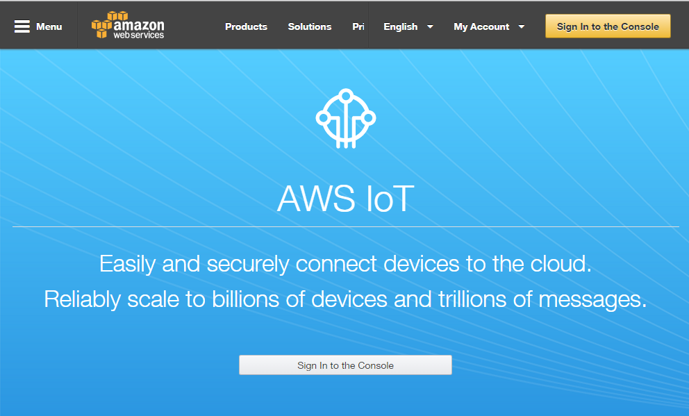
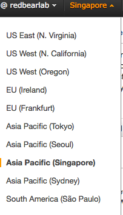
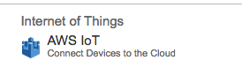
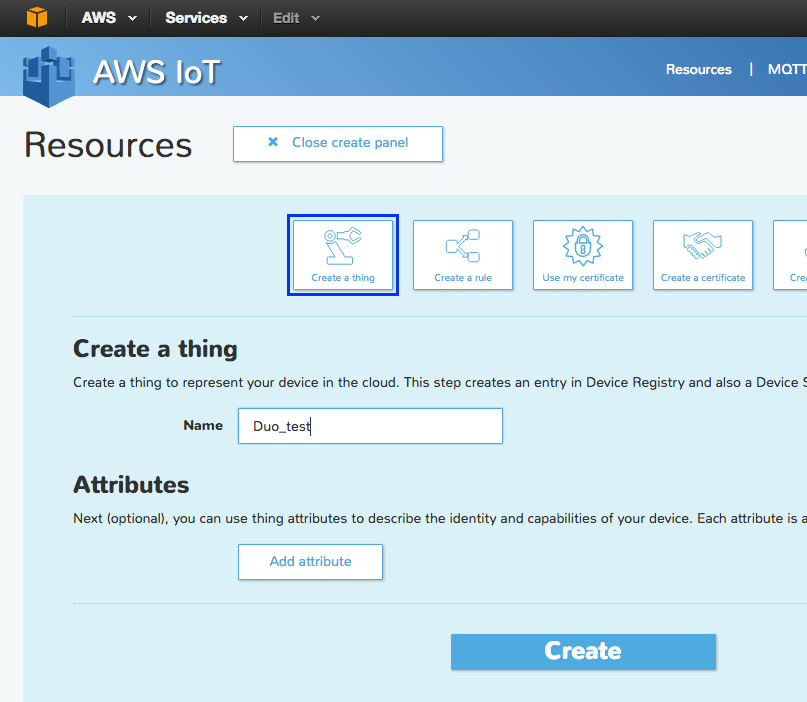
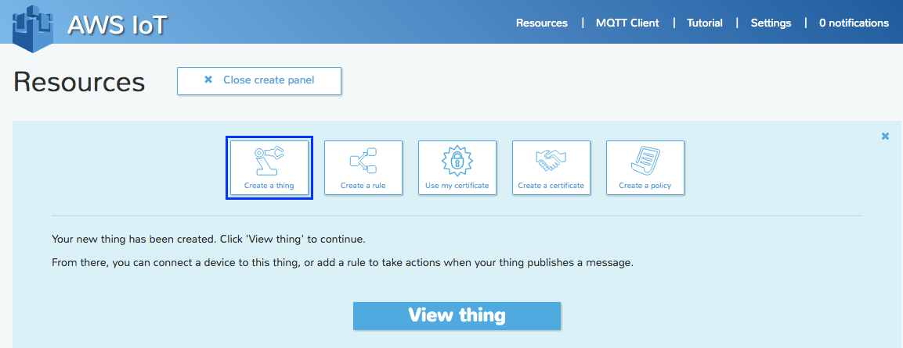
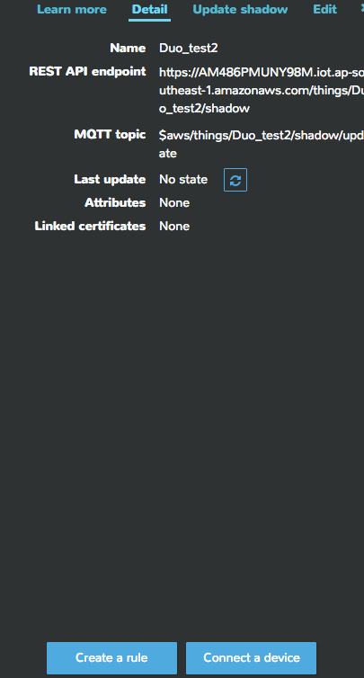
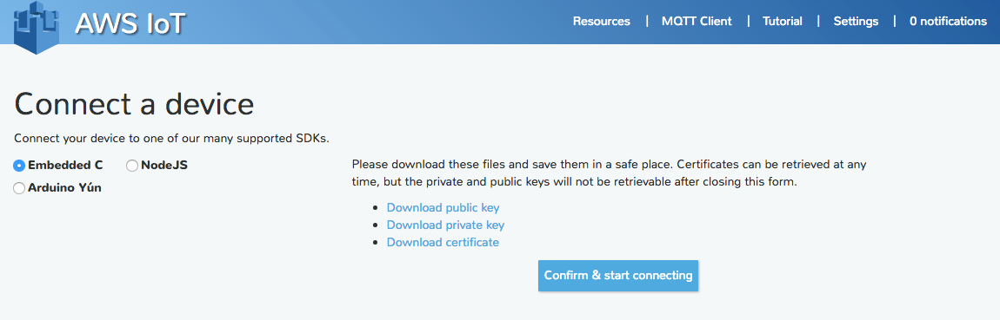
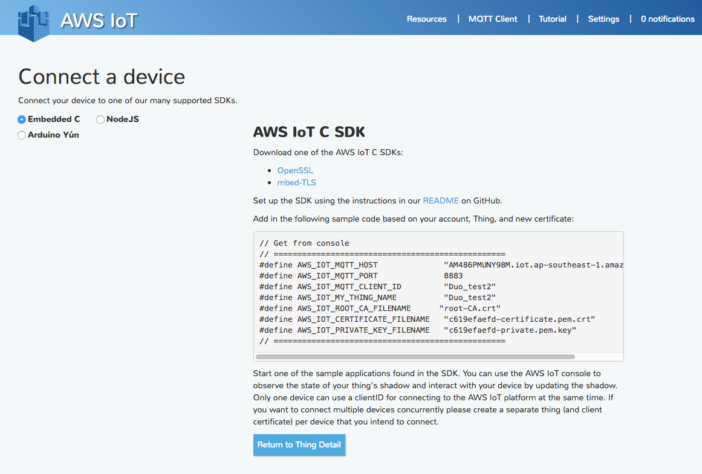
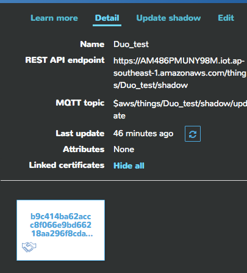
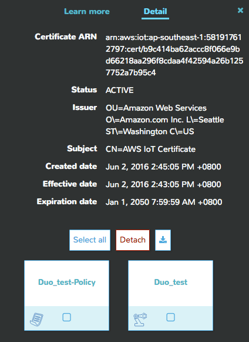

# DUO AWS Started GUIDE #

1. 	Go to Amazon Web Services website and sign in your account .[https://aws.amazon.com/IoT](https://aws.amazon.com/IoT)   
  
2. 	Select server region.(It will influence what you need to change in the example code).    
            
3. In the Internet of Things column, click on AWS IoT to proceed to AWS IoT Console.    
     
4. Click on Create a Resource followed by click on Create a Thing .   
5. Enter a unique name for your board. Such as “Duo_test”
6. Click on Create    
     
7. 	Click on View Thing     
     
8.	Click on Connect a Device     
        
9. 	Click on Embedded C followed by click on Generate Certificate and Policy       
   	 
10. Click on each of the three download links. Use Windows file-explorer to move the downloaded keys and certificate file to a suitable folder, eg.` \AWS_IoT_Credentials`    
       
11. Click on Confirm and Start Connecting       
12. Take a screenshot of the reported #define values (is a useful reference) then click on 
Return to Thing Detail.             
 
13. At this stage your Duo has been fully provisioned with attachment of an active authentication certificate and policy
14.	This can be checked at any time by clicking on your Thing (eg. `Duo_test`)      
15.	Followed by clicking on the Linked Certificate Show All link      
      
16.	Next, click on the certificate shown. Viewed from this perspective you should see:  
  a) The Policy (eg. `Duo_test_Policy`) , and   
  b) The Thing (eg. `Duo_test`)   

17.	Your setup in AWS IoT Console is now complete!          
18.	Next, proceed to the board configuration: upload the shadow example to your Duo, the writing of certificate, key and network configuration details into the flash memory of your Duo。

