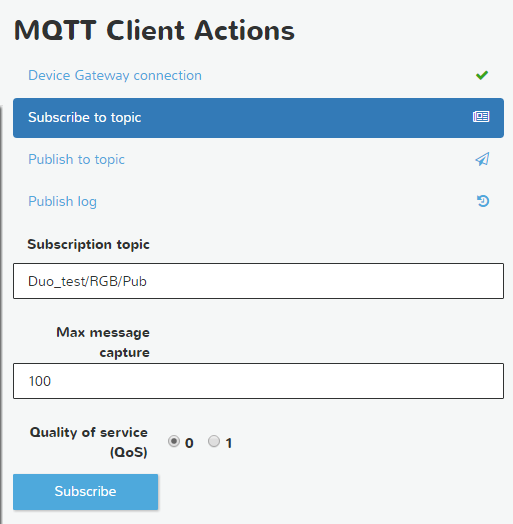
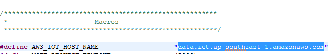
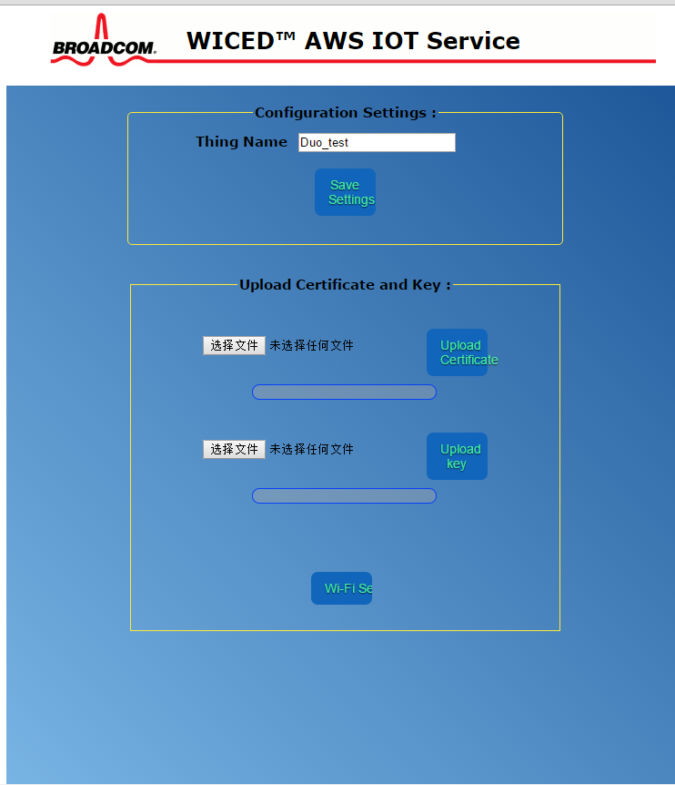
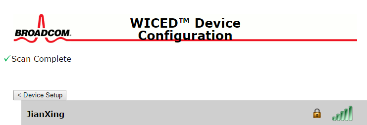
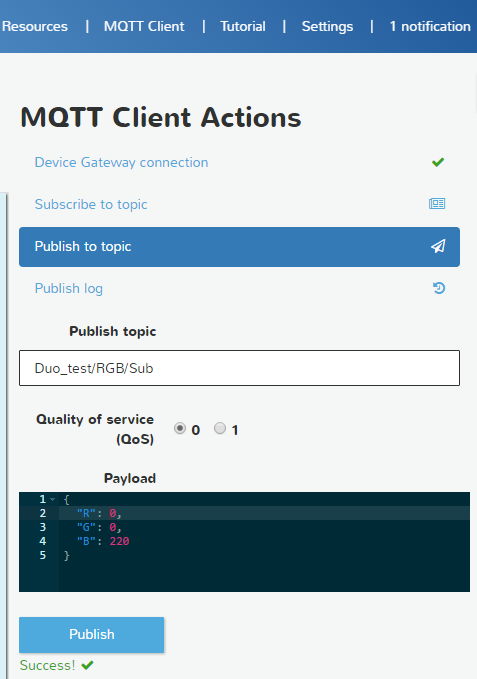
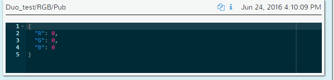
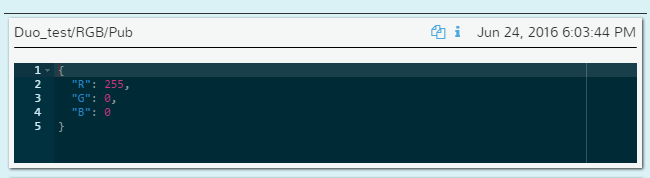

# DUO AWS RGB EXAMPLE#

1. Click MQTT client enter MQTT client action page.   
    
2. Click Subscribe to topic ,input thingName/RGB/Pub,such as Duo_test/RGB/Pub.     
            
3. Check the "`AWS_IOT_HOST_NAME`" in `aws_common.h` if is the same as your account set.If not,please change it to suitable for your account and save the file.    
     
4. Connect the RBLINK to your computer with Duo .   
5. download the shadow example by comman” `demo.aws_iot.aws_Duo_RGB-RB_DUO JTAG=RBLINK download run`”   
6. Connect your computer’s Wi-Fi to WICED_AWS (the SSID of WICED module in SoftAP mode). When prompted, enter a password of 12345678   
7. Enter IP address 192.168.0.1 into your internet browser, this will take you to a webpage served by the board, this is where you define the Thing Name, upload your AWS certificate and Private Key, as well as selecting a suitable Wireless Access Point.     
   
8.Enter the same Thing Name that you used in AWS IoT Console (eg. Duo_test), 
Follow this by clicking on the adjacent Thing Name Save Settings button.      
9.Choose the AWS certificate file that was attached in AWS IoT Console to your Thing 
(eg. 6ae5bf0d7c-certificate.pem.crt in the example slides previously shown)  
Follow this by clicking on the adjacent Upload Certificate button        
10. Choose the AWS private key file that was downloaded at same time as the certificate for your Thing (eg. 6ae5bf0d7c-private.pem.key in the example previously shown)   
Follow this by clicking on the adjacent Upload Key button.  
(A completed progress bar and “Transfer Complete” message should display for both 
the certificate and key uploads)   
11. With the AWS credentials now written to DCT flash memory, proceed to configuring
your network settings. Click on the Wi-Fi Set button, this will take you to a new 
webpage that displays a listing of SSIDs reported from the module’s local scan     
      
12. Select the SSID of the desired Wireless A/P,  enter the applicable Password, then click on the Connect button.              
13. If attempting to connect to a Wireless A/P that does not broadcast it’s SSID, use the 
Add Network manually option that is listed…    
       
14. After connection is made with the selected Wireless A/P, the webpage will darken and the following message will display:       
      
15.	If Duo connect to aws,you will see the the topic  Duo_test/RGB/Pub receive sting “Hello”         
16.	Click Publish to topic, input thingName/RGB/Sub in the Publish topic erar. Input json `{"R": 255,"G": 0,"B": 0}` in the Payload area and click Publish.It will show” Success! “If publish success and if the Duo Subscribe success ,the RGB LED will turn to RED.      
         
17.	Press the SETUP button,the RGB LED will turn off and you will see the the topic Duo_test/RGB/Pub receive json sting `{"R": 0,"G": 0,"B": 0}`.And If you press SETUP again,the LED will turn to the color you set and the topic Duo_test/RGB/Pub receive json sting `{"R":255,"G": 0,"B": 0}`.   
     
         
18.	you can set any RGB value(0~255) as you like,enjoy!~

