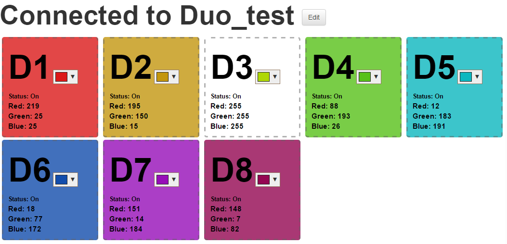

# BLE CENTRAL MULTILINK RGB EXAMPLE#
           
1. Delete the the `wiced_network.c` file in the `WICED-SDK-3.5.2\WICED\network\NetX_Duo\WICED` folder
2. Copy the `001-Fix-AWS-bug.patch` in [patches](https://github.com/redbear/WICED-SDK/tree/master/patches) to the same folder as you have the `WICED-SDK-3.5.2`
3. use the command “`git apply 001-Fix-AWS-bug.patch`" and the `wiced_network.c` file will appear again.
4. Upload the sketch `BLE_RGB_Switch` to every NANO.
5. Change the `NANO_NUM`(not more than 8) in the `ble_peripheral_nano.h` file depend on how many NANOs you have and save the file.
6. Check the "`AWS_IOT_HOST_NAME`" in `aws_common.h` if is the same as your account set.If not,please change it to suitable for your account and save the file.    
     
7. If you has set the certificate&private key &WiFi config before ,download the `ble_central_multilink_rgb` example by comman” `reabear.aws_iot.ble_central_multilink_rgb-RB_DUO JTAG=RBLINK download run no_dct`” and continue step 16.If not,download the `ble_central_multilink_rgb` example by comman”` reabear.aws_iot.ble_central_multilink_rgb-RB_DUO JTAG=RBLINK download run` ” and continue with step 5. 
8. Connect your computer’s Wi-Fi to WICED_AWS (the SSID of WICED module in SoftAP mode). When prompted, enter a password of 12345678   
9. Enter IP address 192.168.0.1 into your internet browser, this will take you to a webpage served by the board, this is where you define the Thing Name, upload your AWS certificate and Private Key, as well as selecting a suitable Wireless Access Point.     
     
10. Enter the same Thing Name that you used in AWS IoT Console (eg. Duo_test), 
Follow this by clicking on the adjacent Thing Name Save Settings button.      
11. Choose the AWS certificate file that was attached in AWS IoT Console to your Thing 
(eg. 6ae5bf0d7c-certificate.pem.crt in the example slides previously shown)  
Follow this by clicking on the adjacent Upload Certificate button        
12. Choose the AWS private key file that was downloaded at same time as the certificate for your Thing (eg. 6ae5bf0d7c-private.pem.key in the example previously shown)   
Follow this by clicking on the adjacent Upload Key button.  
(A completed progress bar and “Transfer Complete” message should display for both 
the certificate and key uploads)   
13. With the AWS credentials now written to DCT flash memory, proceed to configuring
your network settings. Click on the Wi-Fi Set button, this will take you to a new 
webpage that displays a listing of SSIDs reported from the module’s local scan     
      
14. Select the SSID of the desired Wireless A/P,  enter the applicable Password, then click on the Connect button.              
15. If attempting to connect to a Wireless A/P that does not broadcast it’s SSID, use the 
Add Network manually option that is listed…    
       
16. After connection is made with the selected Wireless A/P, the webpage will darken and the following message will display:       
      
17.	Your Duo is now configured for communication with the AWS IoT Services and
the board exits configuration mode and commences running the `ble_central_multilink_rgb` App. 
(Board resets will now auto-connect to selected Wireless A/P and launch the App)   
18. If needing to re-upload different AWS certificate and key, or connect to a different 
Wireless A/P, perform a hard reset by holding SETUP for 5 seconds during Reset  
(this clears the module’s DCT memory and again launches the SoftAP mode)       
19.	When the program runs up,the Duo will connect to AWS and publish “Hello” to the Topic ThingName/RGBPub.      
20.	Join our web server [http://ec2-54-169-213-239.ap-southeast-1.compute.amazonaws.com/](http://ec2-54-169-213-239.ap-southeast-1.compute.amazonaws.com/) and set the ThingName as you set.  
           
21.	the Duo will start to scan Nanos and connect to them. After found and connect all Nanos.You can use web server to control the RGB LED in the Nano Demo board.If you press the button in the Nano Demo board,the RGB LED in it will reverse and the Nano will notify the status to Duo.Duo will publish the data to aws .Then you will see the color change in the web server.If you don’t want to use our web server,you can also use MQTT client and the Duo publish topic is ThingName/RGBPub, subscribe topic is ThingName/RGBSub.The detail of the protocol please check json_format.txt   
             

