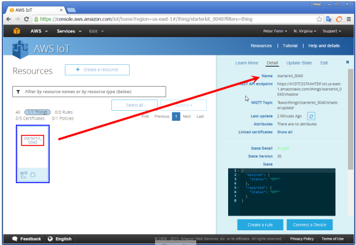
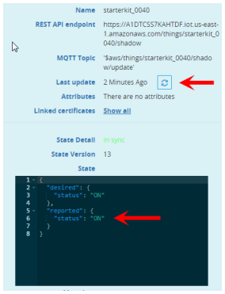
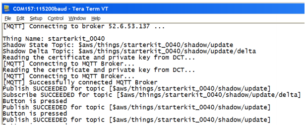
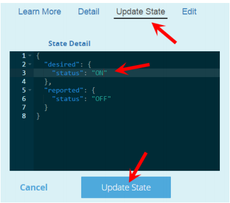

# DUO AWS SHADOW EXAMPLE#
           
3. Connect the RBLINK to your computer with Duo .   
4. download the shadow example by comman” `demo.aws_iot.aws_Duo_RGB-RB_DUO JTAG=RBLINK download run`”   
5. Connect your computer’s Wi-Fi to WICED_AWS (the SSID of WICED module in SoftAP mode). When prompted, enter a password of 12345678   
6. Enter IP address 192.168.0.1 into your internet browser, this will take you to a webpage served by the board, this is where you define the Thing Name, upload your AWS certificate and Private Key, as well as selecting a suitable Wireless Access Point.     
     
7. Enter the same Thing Name that you used in AWS IoT Console (eg. Duo_test), 
Follow this by clicking on the adjacent Thing Name Save Settings button.      
8. Choose the AWS certificate file that was attached in AWS IoT Console to your Thing 
(eg. 6ae5bf0d7c-certificate.pem.crt in the example slides previously shown)  
Follow this by clicking on the adjacent Upload Certificate button        
9. Choose the AWS private key file that was downloaded at same time as the certificate for your Thing (eg. 6ae5bf0d7c-private.pem.key in the example previously shown)   
Follow this by clicking on the adjacent Upload Key button.  
(A completed progress bar and “Transfer Complete” message should display for both 
the certificate and key uploads)   
10. With the AWS credentials now written to DCT flash memory, proceed to configuring
your network settings. Click on the Wi-Fi Set button, this will take you to a new 
webpage that displays a listing of SSIDs reported from the module’s local scan     
      
11. Select the SSID of the desired Wireless A/P,  enter the applicable Password, then click on the Connect button.              
12. If attempting to connect to a Wireless A/P that does not broadcast it’s SSID, use the 
Add Network manually option that is listed…    
       
13. After connection is made with the selected Wireless A/P, the webpage will darken and the following message will display:       
      
14.	Your Duo is now configured for communication with the AWS IoT Services and
the board exits configuration mode and commences running the Shadow App. 
(Board resets will now auto-connect to selected Wireless A/P and launch the App)   
15. If needing to re-upload different AWS certificate and key, or connect to a different 
Wireless A/P, perform a hard reset by holding SETUP for 5 seconds during Reset  
(this clears the module’s DCT memory and again launches the SoftAP mode)       
16.	To commence testing the Shadow application, your internet browser needs to be 
displaying the AWS IoT Console page, with your Starter Kit “Thing” selected    
         
17.	Now press the SETUP User button on the Starter Kit.  
This turns-on USER1 blue LED and updates the Shadow state to “On”To check Shadow state, view this in the right sidebar “Thing” screen of the AWS IoT Console  (- click refresh button to see the changed state) 
)         
18.	Press SETUP Button again, this turns-off USER1 blue LED and updates Shadow state to “Off”  
(- click refresh button to see the changed state)

19.	Repeatedly pressing SETUP increments State Version and toggles on/off the JSON descriptor of the Shadow status. 
Note: Screen updates are delayed!  For immediate updates, click the refresh button   
  
Note: Though not essential to this application, it is helpful to have a Serial Console open 
in order to view the various status messages from the microcontroller as connection is 
made with the MQTT broker and each time the USER button is pressed. (The USB JTAG 
and UART Windows drivers are installed automatically during WICED SDK installation)    
  
The Starter Kit “Publishes” its status to the update topic  
`$aws/things/Duo_test/shadow/update/ `   
The Starter Kit “Subscribes” to (and takes instruction from) the delta topic    
`$aws/things/Duo_test/shadow/update/delta `   
20.	Next we will remotely update the physical USER1 LED on the Starter Kit, by 
publishing to the delta topic, from the IoT Console sidebar in your browser.   
21.	If the User1 LED is currently illuminated, press the User button one more time to 
turn it OFF. Using the “Thing” screen of the AWS IoT Console still displayed in your 
browser, select the “Update State” tab and edit the value of the desired status to 
from “OFF” to “ON” then follow this by clicking Update State   
22.	On clicking this button, the Shadow Thing immediately publishes a JSON update message to the Delta Topic. The Starter Kit which is a Subscriber to the Delta Topic, decodes this message and updates it’s USER1 LED accordingly.   
    

